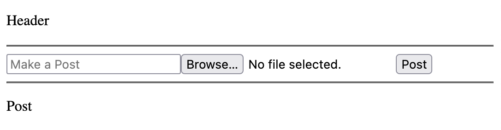
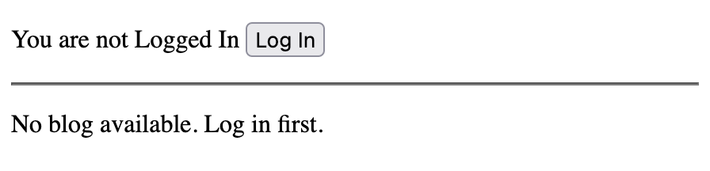
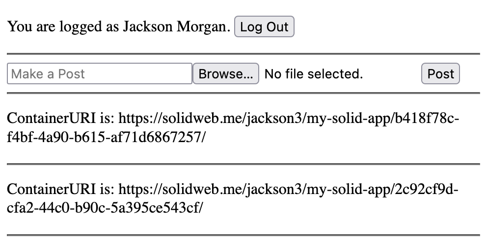

# Using LDO to build a Solid Application for React

Solid separates the application from the storage, allowing users to put their data wherever they choose. Core to achieving this is application interoparability, the ability to use multiple apps on the same dataset. In order to make applications interoperable, Solid is standardized around RDF (Resource Description Framework), a standard for representing data. While RDF is extremely flexible, it is sometimes cumbersome to work with, that's where LDO (Linked Data Objects) comes in.

In this tutorial, we'll build a web application for Solid using React and LDO. LDO's react library, "@ldo/solid-react" is designed to make it easy to manipulate data on a Solid Pod.

We'll be making a simple micro-blogging website that allows you to write notes and upload photos.

// TODO insert image

This tutorial assumes that you are already familiar with React and the overall concepts associated with Solid.

## 1. Getting Started

First, we'll initialize the project. LDO is designed to work with TypeScript, so we want to initialize a typescript react project.

```bash
npx create-react-app my-solid-app --template typescript
cd my-solid-app
```

## 2. Setting up a basic app infrastructure

Before we can use LDO and connect to a Solid Pod, let's get the boilerplace React infrastructure out of the way. We'll set up a single page that renders your blog timeline and lets you make new posts, and we'll do this with 5 components:

**App.tsx**: Base of the application.
```tsx
import React, { FunctionComponent } from 'react';
import { Header } from './Header';
import { Blog } from './Blog';

export const App: FunctionComponent = () => {
  return (
    <div className="App">
      <Header />
      <Blog />
    </div>
  );
}
```

**Header.tsx**: A header component that will help the user log in.
```tsx
import { FunctionComponent } from "react";

export const Header: FunctionComponent = () => {
  return (
    <header>
      <p>Header</p>
      <hr />
    </header>
  );
};
```

**Blog.tsx**: The main place for the blog timeline. We'll use this component to list all posts you've made.
```tsx
import { FunctionComponent } from "react";
import { MakePost } from "./MakePost";
import { Post } from "./Post";

export const Blog: FunctionComponent = () => {
  return (
    <main>
      <MakePost />
      <hr />
      <Post />
    </main>
  );
};
```

**MakePost.tsx**: A form to submit new posts. We've already wired it up with form elements to create a text body and upload an image for the post. We just need to fill out the `onSubmit` function.
```tsx
import { FormEvent, FunctionComponent, useCallback, useState } from "react";

export const MakePost: FunctionComponent = () => {
  const [message, setMessage] = useState("");
  const [selectedFile, setSelectedFile] = useState<File | undefined>();

  const onSubmit = useCallback(
    (e: FormEvent<HTMLFormElement>) => {
      e.preventDefault();

      // TODO upload functionality
    },
    [message, selectedFile]
  );

  return (
    <form onSubmit={onSubmit}>
      <input
        type="text"
        placeholder="Make a Post"
        value={message}
        onChange={(e) => setMessage(e.target.value)}
      />
      <input
        type="file"
        accept="image/*"
        onChange={(e) => setSelectedFile(e.target.files?.[0])}
      />
      <input type="submit" value="Post" />
    </form>
  );
};
```

**Post.tsx**: A component to render a single post.
```tsx
import { FunctionComponent } from "react";

export const Post: FunctionComponent = () => {
  return (
    <div>
      <p>Post</p>
    </div>
  );
};
```

When everything's done, run `npm run start` and your application should look like this:



## Step 3: Installing LDO for Solid and React

With the main infrastructure set up, let's install LDO's Solid/React library.

```bash
npm install @ldo/solid-react
```

This library will give us many useful hooks and components for building a Solid application, but it can't be used unless we wrap the application in a provider. Because we're building a React application in the web browser, we'll wrap the application using the `BrowserSolidLdoProvider`.

**App.tsx**
```tsx
// ...
import { BrowserSolidLdoProvider } from '@ldo/solid-react';

export const App: FunctionComponent = () => {
  return (
    <div className="App">
      <BrowserSolidLdoProvider>
        <Header />
        <Blog />
      </BrowserSolidLdoProvider>
    </div>
  );
}
```

## 4. Implementing Login/Logout in the header

Setting up login for a Solid application is easy when you're using ldo's Solid React library. With the `useSolidAuth()` hook, you can get information and methods to setup login.

In the component below, we use the `session` object for information about the current session including `session.isLoggedIn`, a boolean indicating if the user is currently logged in, and `session.webId` to get the current user's webId. These will automatically update and rerender the component if anything changes about the current session.

Next we use the `login(issuer: string)` method to initiate a login. Because a Solid Pod could be anywhere onthe web, we first ask the user to enter their Solid issuer then provide that to the login function.

Finally, the `logout()` function lets you easily trigger a log out.

**Header.tsx**
```tsx
import { useSolidAuth } from "@ldo/solid-react";
import { FunctionComponent } from "react";

export const Header: FunctionComponent = () => {
  const { session, login, logout } = useSolidAuth();

  return (
    <header>
      {session.isLoggedIn ? (
        // Is the session is logged in
        <p>
          You are logged in with the webId {session.webId}.{" "}
          <button onClick={logout}>Log Out</button>
        </p>
      ) : (
        // If the session is not logged in
        <p>
          You are not Logged In{" "}
          <button
            onClick={() => {
              // Get the Solid issuer the user should log into
              const issuer = prompt(
                "Enter your Solid Issuer",
                "https://solidweb.me"
              );
              if (!issuer) return;
              login(issuer);
            }}
          >
            Log In
          </button>
        </p>
      )}
      <hr />
    </header>
  );
};
```

Because `useSolidAuth` is a hook, you can use it anywhere in the application, even components that don't contain buttons for "login" and "logout." For example, we could use the `session` object in `Blog.tsx` to display a message if the user is not logged in.

```tsx
import { FunctionComponent } from "react";
import { MakePost } from "./MakePost";
import { Post } from "./Post";
import { useSolidAuth } from "@ldo/solid-react";

export const Blog: FunctionComponent = () => {
  const { session } = useSolidAuth();
  if (!session.isLoggedIn) return <p>No blog available. Log in first.</p>;

  return (
    <main>
      // ..
    </main>
  );
};

```

Once you've implemented these changes, the application should look like this when logged out:



And this when logged in:


## 5. Setting up a shape
In step 6, we're going to use information from a user's Solid WebId profile. But, before we can do that, we want to set up a shape for the Solid Profile.

LDO uses ShEx "Shapes" as schemas to describe how data looks in an application. We can get started by using the `init` command line tool to get the project ready to use shapes.

```bash
npx @ldo/cli init
```

This command will install required libraries and creates two folders: the `.shapes` folder and the `.ldo` folder.

If you look in the `.shapes` folder, you'll find a default file called `foafProfile.shex`. This is a ShEx shape that defines a very simplified profile object.

If you look in the `.ldo` folder, you'll files generated from the shape. For example, `foafProfile.typings.ts` contains the Typescript typings associated with the shape, `foafProfile.context.ts` conatians a JSON-LD context for the shape, and `foafProfile.shapeTypes.ts` contains a shape type, a special object that groups all the information for a shape together. We'll be using ShapeTypes later in this tutorial.

For our project, we want to use a Solid Profile, so let's delete the "foafProfile" ShEx shape and make a new file for our Solid profile.

```bash
rm ./src/.shapes/foafProfile.shex
touch ./src/.shapes/solidProfile.shex
```

Now, let's create a shape for the Solid Profile. The code for a Solid profile is listed below, but you can learn more about creating ShEx shapes of your own on the [ShEx website](https://shex.io)

```shex
PREFIX srs: <https://shaperepo.com/schemas/solidProfile#>
PREFIX foaf: <http://xmlns.com/foaf/0.1/>
PREFIX rdfs: <http://www.w3.org/2000/01/rdf-schema#>
PREFIX schem: <http://schema.org/>
PREFIX vcard: <http://www.w3.org/2006/vcard/ns#>
PREFIX xsd: <http://www.w3.org/2001/XMLSchema#>
PREFIX acl: <http://www.w3.org/ns/auth/acl#>
PREFIX cert:  <http://www.w3.org/ns/auth/cert#>
PREFIX ldp: <http://www.w3.org/ns/ldp#>
PREFIX sp: <http://www.w3.org/ns/pim/space#>
PREFIX solid: <http://www.w3.org/ns/solid/terms#>

srs:SolidProfileShape EXTRA a {
  a [ schem:Person ]
    // rdfs:comment  "Defines the node as a Person (from Schema.org)" ;
  a [ foaf:Person ]
    // rdfs:comment  "Defines the node as a Person (from foaf)" ;
  vcard:fn xsd:string ?
    // rdfs:comment  "The formatted name of a person. Example: John Smith" ;
  foaf:name xsd:string ?
    // rdfs:comment  "An alternate way to define a person's name." ;
  vcard:hasAddress @srs:AddressShape *
    // rdfs:comment  "The person's street address." ;
  vcard:hasEmail @srs:EmailShape *
    // rdfs:comment  "The person's email." ;
  vcard:hasPhoto IRI ?
    // rdfs:comment  "A link to the person's photo" ;
  foaf:img xsd:string ?
    // rdfs:comment  "Photo link but in string form" ;
  vcard:hasTelephone @srs:PhoneNumberShape *
    // rdfs:comment  "Person's telephone number" ;
  vcard:phone xsd:string ?
    // rdfs:comment  "An alternative way to define a person's telephone number using a string" ;
  vcard:organization-name xsd:string ?
    // rdfs:comment  "The name of the organization with which the person is affiliated" ;
  vcard:role xsd:string ?
    // rdfs:comment  "The name of the person's role in their organization" ;
  acl:trustedApp @srs:TrustedAppShape *
    // rdfs:comment  "A list of app origins that are trusted by this user" ;
  cert:key @srs:RSAPublicKeyShape *
    // rdfs:comment  "A list of RSA public keys that are associated with private keys the user holds." ;
  ldp:inbox IRI
    // rdfs:comment  "The user's LDP inbox to which apps can post notifications" ;
  sp:preferencesFile IRI ?
    // rdfs:comment  "The user's preferences" ;
  sp:storage IRI *
    // rdfs:comment  "The location of a Solid storage server related to this WebId" ;
  solid:account IRI ?
    // rdfs:comment  "The user's account" ;
  solid:privateTypeIndex IRI *
    // rdfs:comment  "A registry of all types used on the user's Pod (for private access only)" ;
  solid:publicTypeIndex IRI *
    // rdfs:comment  "A registry of all types used on the user's Pod (for public access)" ;
  foaf:knows IRI *
    // rdfs:comment  "A list of WebIds for all the people this user knows." ;
}

srs:AddressShape {
  vcard:country-name xsd:string ?
    // rdfs:comment  "The name of the user's country of residence" ;
  vcard:locality xsd:string ?
    // rdfs:comment  "The name of the user's locality (City, Town etc.) of residence" ;
  vcard:postal-code xsd:string ?
    // rdfs:comment  "The user's postal code" ;
  vcard:region xsd:string ?
    // rdfs:comment  "The name of the user's region (State, Province etc.) of residence" ;
  vcard:street-address xsd:string ?
    // rdfs:comment  "The user's street address" ;
}

srs:EmailShape EXTRA a {
  a [
    vcard:Dom
    vcard:Home
    vcard:ISDN
    vcard:Internet
    vcard:Intl
    vcard:Label
    vcard:Parcel
    vcard:Postal
    vcard:Pref
    vcard:Work
    vcard:X400
  ] ?
    // rdfs:comment  "The type of email." ;
  vcard:value IRI
    // rdfs:comment  "The value of an email as a mailto link (Example <mailto:jane@example.com>)" ;
}

srs:PhoneNumberShape EXTRA a {
  a [
    vcard:Dom
    vcard:Home
    vcard:ISDN
    vcard:Internet
    vcard:Intl
    vcard:Label
    vcard:Parcel
    vcard:Postal
    vcard:Pref
    vcard:Work
    vcard:X400
  ] ?
    // rdfs:comment  "They type of Phone Number" ;
  vcard:value IRI
    // rdfs:comment  "The value of a phone number as a tel link (Example <tel:555-555-5555>)" ;
}

srs:TrustedAppShape {
  acl:mode [acl:Append acl:Control acl:Read acl:Write] +
    // rdfs:comment  "The level of access provided to this origin" ;
  acl:origin IRI
    // rdfs:comment "The app origin the user trusts"
}

srs:RSAPublicKeyShape {
  cert:modulus xsd:string
    // rdfs:comment  "RSA Modulus" ;
  cert:exponent xsd:integer
    // rdfs:comment  "RSA Exponent" ;
}
```

Finally, we can run the command below to build the Solid Profile shape.

```bash
npm run build:ldo
```

You'll notice that the `.ldo` folder contains information about a _solid_ profile.

## 6. Fetching and using information

Let's go back to the header we built. Yeah it's cool, but if your profile includes a name, wouldn't it be better if it said, "You are logged in as Jackson Morgan" rather than "You are logged in with the webId https://solidweb.me/jackson3/profile/card#me?"

Well, we can fix that by retrieving the user's profile document and using the data from it.

We can use the `useResource` and `useSubject` hooks to do this.

```tsx
import { FunctionComponent } from "react";
import { useResource, useSolidAuth, useSubject } from "@ldo/solid-react";
import { SolidProfileShapeShapeType } from "./.ldo/solidProfile.shapeTypes";

export const Header: FunctionComponent = () => {
  const { session, login, logout } = useSolidAuth();
  const webIdResource = useResource(session.webId);
  const profile = useSubject(SolidProfileShapeShapeType, session.webId);

  const loggedInName = webIdResource?.isReading()
    ? "LOADING..."
    : profile?.fn
    ? profile.fn
    : session.webId;

  return (
    <header>
      {session.isLoggedIn ? (
        // Is the session is logged in
        <p>
          You are logged as {loggedInName}.{" "}
          <button onClick={logout}>Log Out</button>
        </p>
      ) : (
// ...
```

The `useResource(uri: string)` will load a provided URI into your application. You can use methods like `.isReading()` to get the current status of the resource. When anything updates with the resource, a rerender will be triggered on your component.

RDF data is automatically loaded into a central dataset inside your application. To access that dataset, we can use `useSubject(uri: string)`. `useSubject` takes in a ShapeType and an uri. It returns a JSON representation of that URI given the ShapeType. In the above example, we've provided the autogenerated `SolidProfileShapeShapeType` as well as the webId. This essentially says to LDO, "The URI I've provided is a Solid Profile. Please give me JSON representing this as a Solid Profile."

Once we have the subject, all we have to do is treat it like JSON. To get the "formalName" for a profile, just call `profile.fn`.

## 7. Getting the main container

Let's move on to building the blog section of our site. One of the biggest questions when building Solid applications is "Where should I save new data?" While that question may have an different answer in the future, today apps traditionally create a new folder to save new data to.

But, to create a new folder, we want to know what the root folder of the application is. At the time of login, the only URL we know is the WebId, so we want to find the root folder for that WebId. It's not always to root domain. For example, on some pod servers a WebId follows this format `https://example.pod/myusername/profile/card#me` and the root file is `https://example.pod/myusername/`. So, how do we know which container is the real root container? Well, we can use the `getRootContainer` method.

Let's add the following hook to **Blog.tsx**

```tsx
// ...
import { useLdo, useResource, useSolidAuth } from "@ldo/solid-react";
import { ConatinerUri } from "@ldo/solid";

export const Blog: FunctionComponent = () => {
  const { session } = useSolidAuth();

  const { getResource } = useLdo();
  const [mainContainerUri, setMainContainerUri] = useState<
    ContainerUri | undefined
  >();

  useEffect(() => {
    if (session.webId) {
      // Get the WebId resource
      const webIdResource = getResource(session.webId);
      // Get the root container associated with that WebId
      webIdResource.getRootContainer().then((rootContainerResult) => {
        // Check if there is an error
        if (rootContainerResult.isError) return;
        // Get a child of the root resource called "my-solid-app/"
        const mainContainer = rootContainerResult.child("my-solid-app/");
        setMainContainerUri(mainContainer.uri);
        // Create the main container if it doesn't exist yet
        mainContainer.createIfAbsent();
      });
    }
  }, [getResource, session.webId]);

  //...
```

Let's walk through what's happening here. First, we can use the `useLdo` hook to get a number of useful functions for interacting with data (and we'll use more in the future). In this case, we're getting the `getResource` function. This serves roughly the same purpose as the `useResource` hook, but in function form rather than hook form. Keep in mind that resources retrieved from the `getResource` function won't trigger rerenders on update, so it's best used when you need a resource for purposes other than the render.

Using the `getResource` function, we get a resource representing the webId. Every resource has the `getRootContainer` method which returns a promise with either the root container, or an error. Everything returned by LDO methods has the `isError` parameter, so you can easily check if it's an error.

We'll then save the URI of the main application container so we can use it in step 8.

Any container resource has the `child` method which gets a representation of the any child, and with that representation we can call the `createIfAbsent` method to create the create out application's main container.

## 8. Rendering Container Children

Before we continue, let's talk a bit about the folder structure for this application. We just got our "main folder", the folder we'll save everything to. Inside that folder, we'll put our individual blog posts. These will be folders themselves with potentially two files: a post data file (index.ttl) and some image file. Overall, our folder layout will look like this:

```
rootContainer/
├─ my-solid-app/
│  ├─ post1/
│  │  ├─ index.ttl
│  │  ├─ some_image.png/
│  ├─ post2/
│  │  ├─ index.ttl
│  │  ├─ another_image.jpg/
```

We've already created the `my-solid-app/` container, so let's add a bit of functionality to create the post folders. Let's modify **MakePost.tsx**.

```tsx
export const MakePost: FunctionComponent<{ mainContainer: Container }> = ({
  mainContainer,
}) => {
  const [message, setMessage] = useState("");
  const [selectedFile, setSelectedFile] = useState<File | undefined>();

  const onSubmit = useCallback(
    async (e: FormEvent<HTMLFormElement>) => {
      e.preventDefault();

      // Create the container for the post
      const postContainerResult = await mainContainer.createChildAndOverwrite(
        `${v4()}/`
      );
      // Check if there was an error
      if (postContainerResult.isError) {
        alert(postContainerResult.message);
        return;
      }
      const postContainer = postContainerResult.resource;
    },
    [message, selectedFile, mainContainer]
  );
  //...
```

Firstly, note that we've added a prop to include a main container. We use this in the `onSubmit` function to call the `createChildAndOverwrite` method. We can generate a name for the sub-folder any way we want, but in this example, we used UUID to generate a random name for the folder.

Finally, we check to see if the result is an error, and if it isn't we extract our new Post container from the result.

Now that we have the ability to create a container, let's view it.

We'll modify **Post.tsx** to include the uri of the post:

```tsx
import { ContainerUri } from "@ldo/solid";

export const Post: FunctionComponent<{ postUri: ContainerUri }> = ({
  postUri,
}) => {
  return (
    <div>
      <p>ContainerURI is: {postUri}</p>
    </div>
  );
};
```

And, in **Blog.tsx** we'll use the `useResource` hook on the main container keep track of the status of the main container. 

```tsx
export const Blog: FunctionComponent = () => {
  const { session } = useSolidAuth();

  const { getResource } = useLdo();
  const [mainContainerUri, setMainContainerUri] = useState<
    ContainerUri | undefined
  >();
  const mainContainer = useResource(mainContainerUri);

  // ...

  return (
    <main>
      <MakePost mainContainer={mainContainer} />
      <hr />
      {mainContainer
        // Get all the children of the main container
        .children()
        // Filter out children that aren't containers themselves
        .filter((child): child is Container => child.type === "container")
        // Render a "Post" for each child
        .map((child) => (
          <Fragment key={child.uri}> 
            <Post key={child.uri} postUri={child.uri} />
            <hr />
          </Fragment>
        ))}
    </main>
  );
};
```

In the render, we can use the `children()` method on the main container to get all the child elements of our container. As discussed earlier, the only children of this container should be containers themselves, so we'll filter out all non-containers. And finally, we render the post for each child.

Once this step is done, you should be able to press the "Post" button to create posts (or at least the container for the post. We'll make the rest of the post in future steps). It should look like this.



## 9. Uploading unstructured data

Pods aren't just for storing containers, of course. They can also about storing raw data like images and videos. Let's add the ability to upload an image to our application.

```tsx
  const onSubmit = useCallback(
    async (e: FormEvent<HTMLFormElement>) => {
      // ...
      // Upload Image
      let uploadedImage: Leaf | undefined;
      if (selectedFile) {
        const result = await postContainer.uploadChildAndOverwrite(
          selectedFile.name as LeafUri,
          selectedFile,
          selectedFile.type
        );
        if (result.isError) {
          alert(result.message);
          await postContainer.delete();
          return;
        }
        uploadedImage = result.resource;
      }
    },
    [message, selectedFile, mainContainer]
  );
```

We added the above section to the onSubmit function in **MakePost.tsx**. In this part of code, we use the selected file created in Step 2 as well as the post container's `uploadChildAndOverwrite` method to upload the file. This method takes in three parameters:
 * The name of the file.
 * The file itself (or any Blob)
 * The file's mime-type

Finally, we check if there's an error, and if there isn't, we assign the result to a variable, `uploadedImage`. We'll use this in step 10.

After implementing this step, your application should now be able to upload photos to your Pod.

## 10. Addeding structured data.

Unstructured data is good, but the real lifeblood of Solid comes from its structured data. In this step, we'll create a Post document that contains the Post's text body, a link to the image, and it's time of posting.

Before we can do that, like we did with the profile, we want to have a ShEx shape for a social media posting. Create a new file called **./.shapes.post.shex** and paste the following ShEx shape.

**./.shapes/post.shex**
```shex
PREFIX rdf: <http://www.w3.org/1999/02/22-rdf-syntax-ns#>
PREFIX rdfs: <http://www.w3.org/2000/01/rdf-schema#>
PREFIX xsd: <http://www.w3.org/2001/XMLSchema#>
PREFIX ex: <https://example.com/>
BASE <http://schema.org/>

ex:PostSh {
  a [<SocialMediaPosting> <CreativeWork> <Thing>] ;
  <articleBody> xsd:string?
      // rdfs:label '''articleBody'''
      // rdfs:comment '''The actual body of the article. ''' ;
  <uploadDate> xsd:date
      // rdfs:label '''uploadDate'''
      // rdfs:comment '''Date when this media object was uploaded to this site.''' ;
  <image> IRI ?
      // rdfs:label '''image'''
      // rdfs:comment '''A media object that encodes this CreativeWork. This property is a synonym for encoding.''' ;
  <publisher> IRI
      // rdfs:label '''publisher'''
      // rdfs:comment '''The publisher of the creative work.''' ;
}
// rdfs:label '''SocialMediaPost'''
// rdfs:comment '''A post to a social media platform, including blog posts, tweets, Facebook posts, etc.'''
```

Now we can build the shapes again by running:

```bash
npm run build:ldo
```

With the new shape in order, let's add some code to **MakePost.tsx** to create the structured data we need.

```tsx
import { PostShShapeType } from "./.ldo/post.shapeTypes";

export const MakePost: FunctionComponent<{ mainContainer: Container }> = ({
  mainContainer,
}) => {
  // ...
  const { createData, commitData } = useLdo();

  const onSubmit = useCallback(
    async (e: FormEvent<HTMLFormElement>) => {
      // ...

      // Create Post
      const indexResource = postContainer.child("index.ttl");
      // Create new data of type "Post" where the subject is the index
      // resource's uri, and write any changes to the indexResource.
      const post = createData(
        PostShShapeType,
        indexResource.uri,
        indexResource
      );
      // Set the article body
      post.articleBody = message;
      if (uploadedImage) {
        // Link the URI to the 
        post.image = { "@id": uploadedImage.uri };
      }
      // Say that the type is a "SocialMediaPosting"
      post.type = { "@id": "SocialMediaPosting" };
      // Add an upload date
      post.uploadDate = new Date().toISOString();
      // The commitData function handles sending the data to the Pod.
      const result = await commitData(post);
      if (result.isError) {
        alert(result.message);
      }
    },
    [mainContainer, selectedFile, createData, message, commitData]
  );
  // ...
```

Structured data is a little different than unstructured data. Data can potentially exist in multiple resources. That isn't the case here, but we're still going to treat index.ttl, the resource, separately from the data we put on the resource.

When we want to create data we can use the `createData` function (which we can get through the `useLdo` hook). `createData` takes three arguments:
* The ShapeType of the data. In this case, we're asserting that this data is a "Post."
* The uri for the data's "subject." In this case, it's the same as the index.ttl resource.
* A list of resources that this data will be written to. All triples that are created when you modify this data will be saved to this list of resources.

From there, we can just modify the data as if it were normal JSON. Note that in some cases we set a field to `{ "@id": uri }`. This means that the field should point to the given URI.

Finally the `commitData()` method takes the modified data and syncs it with the Solid Pods.

When all is saved, the data on the Pod should look something like this:

```turtle
<https://solidweb.me/jackson3/my-solid-app/7780dac6-7ed2-4ab1-ab31-e63257bc4b3f/index.ttl> <http://schema.org/articleBody> "Hello this is a post";
    <http://schema.org/image> <https://solidweb.me/jackson3/my-solid-app/7780dac6-7ed2-4ab1-ab31-e63257bc4b3f/coolImage.png>;
    a <http://schema.org/SocialMediaPosting>;
    <http://schema.org/uploadDate> "2023-09-26T19:01:17.263Z"^^<http://www.w3.org/2001/XMLSchema#date>.

```

## 11. Displaying the Post
Finally, let's bring it all together and modify **Post.tsx** to display the uploaded data.

**Post.tsx**
```tsx
import { FunctionComponent, useCallback, useMemo } from "react";
import { ContainerUri, LeafUri } from "@ldo/solid";
import { useLdo, useResource, useSubject } from "@ldo/solid-react";
import { PostShShapeType } from "./.ldo/post.shapeTypes";

export const Post: FunctionComponent<{ postUri: ContainerUri }> = ({
  postUri,
}) => {
  const postIndexUri = `${postUri}index.ttl`;
  const postResource = useResource(postIndexUri);
  const post = useSubject(PostShShapeType, postIndexUri);
  const { getResource } = useLdo();
  const imageResource = useResource(
    post?.image?.["@id"] as LeafUri | undefined
  );

  // Convert the blob into a URL to be used in the img tag
  const blobUrl = useMemo(() => {
    if (imageResource && imageResource.isBinary()) {
      return URL.createObjectURL(imageResource.getBlob()!);
    }
    return undefined;
  }, [imageResource]);

  const deletePost = useCallback(async () => {
    const postContainer = getResource(postUri);
    await postContainer.delete();
  }, [postUri, getResource]);

  if (postResource.status.isError) {
    return <p>postResource.status.message</p>;
  }

  return (
    <div>
      <p>{post.articleBody}</p>
      {blobUrl && (
        
      )}
      <button onClick={deletePost}>Delete Post</button>
    </div>
  );
};
```

Here, we've employed a few concepts that we're already familiar with as well as a few new tricks. Of course, we're using "useResource" and "useSubject" to get data about the Post. Then we can render that information by treating it just like JSON. For example `<p>{post.articleBody}</p>`.

Notice that we can get the URL for the image with `post.image["@id"]`, but we're not using that directly in the img tag (eg ``). Why? Many resources on a Solid Pod (these included) are not open to the public. If we put the image URL directly in the the img tag, the request to get that image would be unauthorized. Instead, we perform an authenticated fetch on the image the same way we do with anything else: using `useResource`. Once we have the resource, we can convert the resource to a blob url with `URL.createObjectURL(imageResource.getBlob())`.

We've also added a delete button. Deleting containers and resources is just as simple as running `resource.delete()`.

## Conclusion

And with that, you have a fully functional Solid application. LDO's React/Solid integration keeps track of state and makes sure everything is run efficiently so you can focus on developing your application.