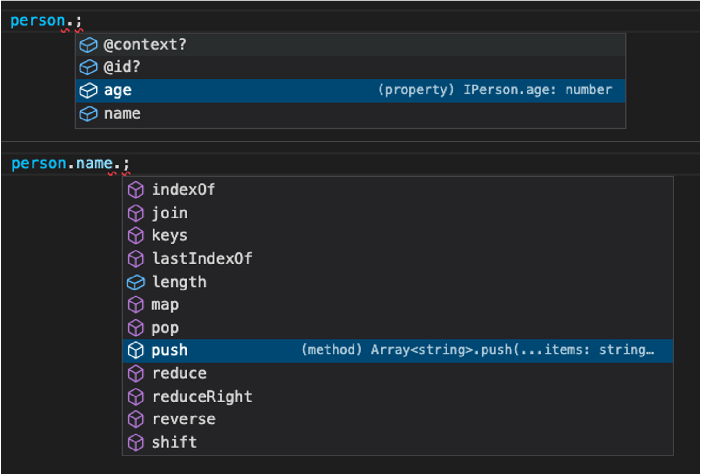

# JSONLD Dataset Proxy

Edit RDFJS Dataset just like regular JavaScript Object Literals.

Just a few lines of familiar code:
```typescript
const personNode = namedNode("http://example.com/Person1");
const person = jsonldDatasetProxy(
  dataset,
  PersonContext
).fromSubject<IPerson>(namedNode("http://example.com/Person1"));
person.age = 23;
person.name.push("John");
```

are equivalent to:
```typescript
dataset.deleteMatches(
  namedNode("http://example.com/Person1"),
  namedNode("http://xmlns.com/foaf/0.1/age")
);
dataset.add(
  quad(
    namedNode("http://example.com/Person1"),
    namedNode("http://xmlns.com/foaf/0.1/age"),
    literal("23", "http://www.w3.org/2001/XMLSchema#integer")
  )
);
dataset.add(
  quad(
    namedNode("http://example.com/Person1"),
    namedNode("http://xmlns.com/foaf/0.1/name"),
    literal("John", "http://www.w3.org/2001/XMLSchema#string")
  )
);
```

Plus, you get IntelliSense typescript suggestions to help you write your code!




## Installation
```bash
npm install jsonld-dataset-proxy
```

## Simple Example
```typescript
import jsonldDatasetProxy, { write } from "jsonld-dataset-proxy";
import { ContextDefinition } from "jsonld";
import { serializedToDataset } from "o-dataset-pack";
import { namedNode } from "@rdfjs/data-model";

async function start() {
  // Define initial data
  const initialData = `
    @prefix example: <http://example.com/> .
    @prefix foaf: <http://xmlns.com/foaf/0.1/> .
    @prefix xsd: <http://www.w3.org/2001/XMLSchema#> .
    
    example:Person1
      foaf:name "Johnathan"^^xsd:string;
      foaf:age "22"^^xsd:integer.
  `;
  // Create a dataset loaded with initial data
  const dataset = await serializedToDataset(initialData);
  // Make a JSONLD Dataset Proxy
  const person = jsonldDatasetProxy(
    dataset,
    PersonContext
  ).fromSubject<IPerson>(namedNode("http://example.com/Person1"));
  // Make Modifications
  person.age = 23;
  person.name.push("John");
  write(namedNode("http://example.com/otherGraph")).using(person);
  person.name.push("Smith");

  console.log(dataset.toString());
  // Logs:
  // <http://example.com/Person1> <http://xmlns.com/foaf/0.1/name> "Johnathan" .
  // <http://example.com/Person1> <http://xmlns.com/foaf/0.1/name> "John" .
  // <http://example.com/Person1> <http://xmlns.com/foaf/0.1/age> "23"^^<http://www.w3.org/2001/XMLSchema#integer> .
  // <http://example.com/Person1> <http://xmlns.com/foaf/0.1/name> "Smith" <http://example.com/otherGraph> .
}

// Person Typescript Typing
interface IPerson {
  name: string[];
  age: number;
}

// Person JSONLD Context
const PersonContext: ContextDefinition = {
  name: {
    "@id": "http://xmlns.com/foaf/0.1/name",
    "@type": "http://www.w3.org/2001/XMLSchema#string",
    "@container": "@set",
  },
  age: {
    "@id": "http://xmlns.com/foaf/0.1/age",
    "@type": "http://www.w3.org/2001/XMLSchema#integer",
  },
};

start();
```

## Full Usage

 - [Defining a Context and Type](#defining-a-context-and-type)
 - [Getting a Jsonld DatasetProxy](#getting-a-jsonld-dataset-proxy)
   - [`.fromSubject<T>(entryNode)`](#fromsubjecttentrynode)
   - [`.matchSubject<T>(predicate?, object?, graph?)`](#matchsubjecttpredicate-object-graph)
   - [`.matchObject<T>(subject?, predicate?, graph?)`](#matchobjecttsubject-predicate-object)
   - [`.fromJson<T>(inputData)`](#fromjsontinputdata)
 - [Getting Field Values and Traversing](#getting-field-values-and-traversing)
 - [Setting a Primitive](#setting-a-primitive)
 - [Setting an Object](#setting-an-object)
 - [Array Methods](#array-methods)
 - [Overwriting an Object](#overwriting-an-object)
 - [Changing an Object's Id](#changing-an-objects-id)
 - [Removing an Object Connection](#removing-an-object-connection)
 - [Deleting an Entire Object](#deleting-an-entire-object)
 - [Using Blank Nodes](#using-blank-nodes)
 - [Writing Information to a Specific Graph](#writing-information-to-a-specific-graph)
    - [`jsonldDatasetProxy(...).write(...graphs)`](#jsonlddatasetproxywritegraphs)
    - [`write(...graphs).using(...jsonldDatasetProxies)`](#writegraphsusingjsonlddatasetproxies)
    - [`write(...graphs).usingCopy(...jsonldDatasetProxies)`](#writegraphsusingcopyjsonlddatasetproxies)
 - [Detecting a the graph of specific information](#detecting-a-the-graph-of-specific-information)

For the most part, a JSONLD Dataset Proxy has parity with JavaScript Object Literals. However, there are a few differences to highlight. This section details how you would do different tasks.

### Defining a Context and Type
The first step to getting a JSONLD Dataset Proxy is defining the JSONLD Context and TypeScript Typings. This can either be done through a [generator](https://github.com/o-development/shexj2typeandcontext) or defining them manually.

In this example typescript typing `IPerson` is an interface that represents a person. Notice the `@id` and `@context` fields. Be sure to include them in your interfaces if you wish to use those properties.

```typescript
import { ContextDefinition } from "jsonld";

interface IPerson {
  "@id"?: string;
  "@context"?: ContextDefinition;
  name?: string[];
  age?: number;
  bestFriend?: IPerson;
  knows?: IPerson[];
}
```

We can make a [JSONLD context](https://w3c.github.io/json-ld-syntax/#the-context) to match this type:

```typescript
import { ContextDefinition } from "jsonld";

const PersonContext: ContextDefinition = {
  name: {
    "@id": "http://xmlns.com/foaf/0.1/name",
    "@type": "http://www.w3.org/2001/XMLSchema#string",
    "@container": "@set",
  },
  age: {
    "@id": "http://xmlns.com/foaf/0.1/age",
    "@type": "http://www.w3.org/2001/XMLSchema#integer",
  },
  bestFriend: {
    "@id": "http://xmlns.com/foaf/0.1/bestFriend",
    "@type": "@id",
  },
  knows: {
    "@id": "http://xmlns.com/foaf/0.1/knows",
    "@type": "@id",
    "@container": "@set",
  },
};
```

To do this, create an object that has corresponding fields to your type. Each field is an object that contains the following properties:
 - `@id`: indicates the URI of the corresponding predicate
 - `@type`: If the corresponding type is a pimitive (Like a number or string), use this field to list the RDF Literal type (Most often this is an XMLSchema type). If the corresponding type is an object, list `@id` here.
 - `@container`: If the corresponding type is an array of items, set `@container` to `@set`, if not, do not include the `@container` property.

Note that only the features described here work with JSONLD Dataset Proxy. Other features of JSONLD Contexts are not yet supported.

### Getting a Jsonld Dataset Proxy
Once the Typescript Typings and Context have been defined, we can get the JSONLD Dataset Proxy for a specific dataset.

```typescript
import jsonldDatasetProxy from "jsonld-dataset-proxy";
import { createDataset } from "o-dataset-pack";

const dataset = await createDataset();
// Make a JSONLD Dataset Proxy
const person = jsonldDatasetProxy(
  dataset,
  PersonContext
) // ...
```

The functon `jsonldDatasetProxy` takes in three parameters:
 - `dataset`: The dataset you wish to traverse and manipulate. This can be any dataset that follows the [RDFJS Dataset Interface](https://rdf.js.org/dataset-spec/#dataset-interface). Note that this is not to be confused with the RDFJS Dataset ***Core*** interface. This example uses the "o-dataset-pack", but any implementation of the RDFJS Dataset Interface is acceptable.
 - `context`: The JSONLD context.

 After defining the `dataset` and `context` there are a few ways to get Jsonld Dataset Proxies:

#### `.fromSubject<T>(entryNode)`
`fromSubject` lets you define a an `entryNode`, the place of entry for the graph. The object returned by `jsonldDatasetProxy` will represent the given node. This parameter accepts both `namedNode`s and `blankNode`s. `fromSubject` takes a generic type representing the typescript type of the given subject.

```typescript
const person = jsonldDatasetProxy(
  dataset,
  PersonContext
).fromSubject<IPerson>(namedNode("http://example.com/Person1"));
```

#### `.matchSubject<T>(predicate?, object?, graph?)`
`matchSubject` returns a Jsonld Dataset Proxy representing all subjects in the dataset matching the given predicate, object, and graph.

```typescript
const people = jsonldDatasetProxy(
  dataset,
  PersonContext
).matchSubject<IPerson>(
  namedNode("http://www.w3.org/1999/02/22-rdf-syntax-ns#type"),
  namedNode("http://xmlns.com/foaf/0.1/Person")
);
people.forEach((person) => {
  console.log(person.name);
});
```

#### `.matchObject<T>(subject?, predicate?, object?)`
`matchObject` returns a Jsonld Dataset Proxy representing all objects in the dataset matching the given subject, predicate, and graph.

```typescript
const friendsOfPerson1 = jsonldDatasetProxy(
  dataset,
  PersonContext
).matchSubject<IPerson>(
  namedNode("http://example.com/Person1"),
  namedNode("http://xmlns.com/foaf/0.1/knows")
);
friendsOfPerson1.forEach((person) => {
  console.log(person.name);
});
```

#### `.fromJson<T>(inputData)`
`fromJson` will take any regular Json, add the information to the dataset, and return a Jsonld Dataset Proxy representing the given data.

```typescript
const person2 = jsonldDatasetProxy(
  dataset,
  PersonContext
).fromJson<IPerson>({
  "@id": "http://example.com/Person2",
  name: ["Jane", "Doe"],
  birthdate: "1990/11/03",
  age: 33,
});
```

### Getting Field Values and Traversing
Getting a field and traversing the object is just as easy as getting data out of a standard JavaScript Object Literal.

In all the following example, we will use a dataset loaded with the following data:

```typescript
const dataset = await serializedToDataset(`
  @prefix example: <http://example.com/> .
  @prefix foaf: <http://xmlns.com/foaf/0.1/> .
  @prefix xsd: <http://www.w3.org/2001/XMLSchema#> .
  
  example:Person1
    foaf:name "Johnathan"^^xsd:string, "John"^^xsd:string;
    foaf:age "22"^^xsd:integer;
    foaf:bestFriend example:Person2;
    foaf:friends example:Person2, example:Person3.
  
  example:Person2
    foaf:name "Alice"^^xsd:string;
    foaf:age "28"^^xsd:integer.
  
  example:Person3
    foaf:name "Dave"^^xsd:string;
    foaf:age "33"^^xsd:integer.
`);
const person = jsonldDatasetProxy(
  dataset,
  PersonContext
).fromSubject<IPerson>(namedNode("http://example.com/Person1"));
// Get primitives
console.log(person.age); // 22
// Get nested primitives
console.log(person?.bestFriend?.age); // 28
// All array methods work
console.log(person.name?.reduce((agg, cur) => agg + cur, "")); // JonathanJohn
// You can also access array items via their index
// But this isn't recommened. The library will do its best to maintain the
// ordering in the array, but as datasets have no concept of order, this is
// not always accurate.
console.log(person.name?.[1]); // John
// Get the id of the object
// (If the node is a blankNode the @id will be undefined)
console.log(person.bestFriend?.["@id"]); // "http://example.com/Person2"
// Finally, you can retrieve the context
console.log(person["@context"]); // { "name": { "@id": ... }}
```


### Setting a Primitive
Setting a non-array primitive will remove the existing triple from the dataset and add a new triple.

```typescript
const dataset = createDataset();
const person = jsonldDatasetProxy(
  dataset,
  PersonContext
).fromSubject<IPerson>(namedNode("http://example.com/Person1"))
person.age = 23;
console.log(dataset.toString());
// <http://example.com/Person1> <http://xmlns.com/foaf/0.1/age> "23"^^<http://www.w3.org/2001/XMLSchema#integer> .
```

### Setting an Object
Setting a field to a JavaScript object literal will recursively add all parts of the object literal to the dataset.

```typescript
const dataset = createDataset();
const person = jsonldDatasetProxy(
  dataset,
  PersonContext
).fromSubject<IPerson>(namedNode("http://example.com/Person1"));
person.bestFriend = {
  "@id": "http://example.com/Person2",
  name: ["Alice"],
  bestFriend: {
    "@id": "http://example.com/Person3",
    name: ["Bob"],
  },
};
console.log(dataset.toString());
// <http://example.com/Person1> <http://xmlns.com/foaf/0.1/bestFriend> <http://example.com/Person2> .
// <http://example.com/Person2> <http://xmlns.com/foaf/0.1/bestFriend> <http://example.com/Person3> .
// <http://example.com/Person2> <http://xmlns.com/foaf/0.1/name> "Alice" .
// <http://example.com/Person3> <http://xmlns.com/foaf/0.1/name> "Bob" .
```

### Array Methods
Any methods that modify arrays work as expected.

```typescript
const dataset = await serializedToDataset(`
  @prefix example: <http://example.com/> .
  @prefix foaf: <http://xmlns.com/foaf/0.1/> .
  @prefix xsd: <http://www.w3.org/2001/XMLSchema#> .
  
  example:Person1
    foaf:name "Garrett"^^xsd:string, "Bobby"^^xsd:string.
`);
const person = jsonldDatasetProxy(
  dataset,
  PersonContext
).fromSubject<IPerson>(namedNode("http://example.com/Person1"));
person.name?.push("Ferguson");
console.log(dataset.toString());
// <http://example.com/Person1> <http://xmlns.com/foaf/0.1/name> "Garrett" .
// <http://example.com/Person1> <http://xmlns.com/foaf/0.1/name> "Bobby" .
// <http://example.com/Person1> <http://xmlns.com/foaf/0.1/name> "Ferguson" .
```

### Overwriting an Object
If an object literal is set and the id is equivalent to an existing id, that node will be overwritten. All triples from the previous object are removed and replaced with triples from the new object.

```typescript
const dataset = await serializedToDataset(`
  @prefix example: <http://example.com/> .
  @prefix foaf: <http://xmlns.com/foaf/0.1/> .
  @prefix xsd: <http://www.w3.org/2001/XMLSchema#> .
  
  example:Person2
    foaf:name "Alice"^^xsd:string;
    foaf:age "28"^^xsd:integer.
`);
const person = jsonldDatasetProxy(
  dataset,
  PersonContext,
).fromSubject<IPerson>(namedNode("http://example.com/Person1"));
person.bestFriend = {
  "@id": "http://example.com/Person2",
  name: ["Jane"],
};
console.log(dataset.toString());
// <http://example.com/Person2> <http://xmlns.com/foaf/0.1/name> "Jane" .
// <http://example.com/Person1> <http://xmlns.com/foaf/0.1/bestFriend> <http://example.com/Person2> .
```

### Changing an Object's Id
You can rename an object by setting its `@id` field. This will update all triples that reference the id to the new id.

```typescript
const dataset = await serializedToDataset(`
  @prefix example: <http://example.com/> .
  @prefix foaf: <http://xmlns.com/foaf/0.1/> .
  @prefix xsd: <http://www.w3.org/2001/XMLSchema#> .

  example:Person1
    foaf:name "Alice"^^xsd:string;
    foaf:bestFriend example:Person2.
  
  example:Person2
    foaf:bestFriend example:Person1.
`);
const person = jsonldDatasetProxy(
  dataset,
  PersonContext
).fromSubject<IPerson>(namedNode("http://example.com/Person1"))
person["@id"] = "http://example.com/NewPersonId";
console.log(dataset.toString());
// <http://example.com/Person2> <http://xmlns.com/foaf/0.1/bestFriend> <http://example.com/NewPersonId> .
// <http://example.com/NewPersonId> <http://xmlns.com/foaf/0.1/name> "Alice" .
// <http://example.com/NewPersonId> <http://xmlns.com/foaf/0.1/bestFriend> <http://example.com/Person2> .
```

### Removing an Object Connection
Removing one triple can be done by setting a property to `undefined`;

```typescript
const dataset = await serializedToDataset(`
  @prefix example: <http://example.com/> .
  @prefix foaf: <http://xmlns.com/foaf/0.1/> .
  @prefix xsd: <http://www.w3.org/2001/XMLSchema#> .

  example:Person1
    foaf:name "Alice"^^xsd:string;
    foaf:bestFriend example:Person2.
  
  example:Person2
    foaf:name "Bob"^^xsd:string;
    foaf:bestFriend example:Person1.
`);
const person = jsonldDatasetProxy(
  dataset,
  PersonContext
).fromSubject<IPerson>(namedNode("http://example.com/Person1"));
person.bestFriend = undefined;
console.log(dataset.toString());
// <http://example.com/Person1> <http://xmlns.com/foaf/0.1/name> "Alice" .
// <http://example.com/Person2> <http://xmlns.com/foaf/0.1/name> "Bob" .
// <http://example.com/Person2> <http://xmlns.com/foaf/0.1/bestFriend> <http://example.com/Person1> .
```

### Deleting an Entire Object
If you want to delete all triples represented by an object, there are two ways using the `delete` operator.

First, you can call `delete` on a specific property:
```typescript
const dataset = await serializedToDataset(`
  @prefix example: <http://example.com/> .
  @prefix foaf: <http://xmlns.com/foaf/0.1/> .
  @prefix xsd: <http://www.w3.org/2001/XMLSchema#> .

  example:Person1
    foaf:name "Alice"^^xsd:string;
    foaf:bestFriend example:Person2.
  
  example:Person2
    foaf:name "Bob"^^xsd:string;
    foaf:bestFriend example:Person1.
`);
const person = jsonldDatasetProxy(
  dataset,
  PersonContext
).fromSubject<IPerson>(namedNode("http://example.com/Person1"));
delete person.bestFriend;
console.log(dataset.toString());
// <http://example.com/Person1> <http://xmlns.com/foaf/0.1/name> "Alice" .
```

And secondly, you can call `delete` on the `@id` property.
```typescript
const dataset = await serializedToDataset(`
  @prefix example: <http://example.com/> .
  @prefix foaf: <http://xmlns.com/foaf/0.1/> .
  @prefix xsd: <http://www.w3.org/2001/XMLSchema#> .

  example:Person1
    foaf:name "Alice"^^xsd:string;
    foaf:bestFriend example:Person2.
  
  example:Person2
    foaf:name "Bob"^^xsd:string;
    foaf:bestFriend example:Person1.
`);
const person = jsonldDatasetProxy(
  dataset,
  PersonContext
).fromSubject<IPerson>(namedNode("http://example.com/Person1"));
delete person["@id"];
console.log(dataset.toString());
// <http://example.com/Person2> <http://xmlns.com/foaf/0.1/name> "Bob" .
```

### Using Blank Nodes
If you want to create an object with a blankNode subject, simply omit the `@id` field when you're making the object.
```typescript
const dataset = await createDataset();
const person = jsonldDatasetProxy(
  dataset,
  PersonContext
).fromSubject<IPerson>(namedNode("http://example.com/Person1"));
person.bestFriend = {
  name: ["Charlie"],
};
console.log(dataset.toString());
// <http://example.com/Person1> <http://xmlns.com/foaf/0.1/bestFriend> _:b1 .
// _:b1 <http://xmlns.com/foaf/0.1/name> "Charlie" .
```

If your dataset has blank nodes and you want to assign that blank node as a triple's object, you can retrieve it from the JSONLD Dataset Proxy and assign it.
```typescript
const dataset = await serializedToDataset(`
  @prefix example: <http://example.com/> .
  @prefix foaf: <http://xmlns.com/foaf/0.1/> .
  @prefix xsd: <http://www.w3.org/2001/XMLSchema#> .
  
  example:Person1
    foaf:knows [
      foaf:name "Alice"^^xsd:string;
    ].
`);
const person = jsonldDatasetProxy(
  dataset,
  PersonContext,
).fromSubject<IPerson>(namedNode("http://example.com/Person1"));

const alice = person.knows?.[0];
person.bestFriend = alice;
console.log(dataset.toString());
// _:n3-0 <http://xmlns.com/foaf/0.1/name> "Alice" .
// <http://example.com/Person1> <http://xmlns.com/foaf/0.1/knows> _:n3-0 .
// <http://example.com/Person1> <http://xmlns.com/foaf/0.1/bestFriend> _:n3-0 .
```

### Writing Information to a Specific Graph
By default, all new quads are added to the default graph, but you can change the graph to which new quads are added in a few different ways:

NOTE: These operations only dictate the graph for new triples. Any operations that delete triples will delete triples regardless of their graph.

#### `jsonldDatasetProxy(...).write(...graphs)`
The write graph can be set upon creating a jsonld dataset proxy by using the `write` method. This method takes in any number of graphs.

```typescript
const person1 = jsonldDatasetProxy(dataset, PersonContext)
  .write(namedNode("http://example.com/ExampleGraph"))
  .fromSubject<IPerson>(namedNode("http://example.com/Person1"));
person1.name.push("Jack");
console.log(dataset.toString());
// Logs:
// <http://example.com/Person1> <http://xmlns.com/foaf/0.1/name> "Jack" <http://example.com/ExampleGraph> .
```

#### `write(...graphs).using(...jsonldDatasetProxies)`
The `write(...).using(...)` function lets you define the graphs you wish to write to using specific jsonldDatasetProxies.

```typescript
import jsonldDatasetProxy, { write } from "jsonld-dataset-proxy";

const person1 = jsonldDatasetProxy(
  dataset,
  PersonContext
).fromSubject<IPerson>(namedNode("http://example.com/Person1"));
// Now all additions with person1 will be on ExampleGraph1
write(namedNode("http://example.com/ExampleGraph1")).using(person1);
person1.name.push("Jack");
// Now all additions with person1 will be on ExampleGraph2
write(namedNode("http://example.com/ExampleGraph2")).using(person1);
person1.name.push("Spicer");

console.log(dataset.toString());
// Logs:
// <http://example.com/Person1> <http://xmlns.com/foaf/0.1/name> "Jack" <http://example.com/ExampleGraph1> .
// <http://example.com/Person1> <http://xmlns.com/foaf/0.1/name> "Spicer" <http://example.com/ExampleGraph2> .
```

The function also returns an `end` function that will reset the graph to what it was before. This is useful for nesting graph modifications.

```typescript
const person1 = jsonldDatasetProxy(
  dataset,
  PersonContext
).fromSubject<IPerson>(namedNode("http://example.com/Person1"));
person1.name.push("default");
const end1 = write(namedNode("http://example.com/Graph1")).using(person1);
person1.name.push("1");
const end2 = write(namedNode("http://example.com/Graph2")).using(person1);
person1.name.push("2");
const end3 = write(namedNode("http://example.com/Graph3")).using(person1);
person1.name.push("3");
end3();
person1.name.push("2 again");
end2();
person1.name.push("1 again");
end1();
person1.name.push("default again");
console.log(dataset.toString());
// Logs:
// <http://example.com/Person1> <http://xmlns.com/foaf/0.1/name> "default" .
// <http://example.com/Person1> <http://xmlns.com/foaf/0.1/name> "default again" .
// <http://example.com/Person1> <http://xmlns.com/foaf/0.1/name> "1" <http://example.com/Graph1> .
// <http://example.com/Person1> <http://xmlns.com/foaf/0.1/name> "1 again" <http://example.com/Graph1> .
// <http://example.com/Person1> <http://xmlns.com/foaf/0.1/name> "2" <http://example.com/Graph2> .
// <http://example.com/Person1> <http://xmlns.com/foaf/0.1/name> "2 again" <http://example.com/Graph2> .
// <http://example.com/Person1> <http://xmlns.com/foaf/0.1/name> "3" <http://example.com/Graph3> .
```

#### `write(...graphs).usingCopy(...jsonldDatasetProxies)`
If you would like a new variable to write to without modifying the original Jsonld Dataset Proxy, you can use `write(...).usingCopy(...)`.

```typescript
const person1 = jsonldDatasetProxy(
  dataset,
  PersonContext
).fromSubject<IPerson>(namedNode("http://example.com/Person1"));
const [person1WritingToNewGraph] = write(
  namedNode("http://example.com/NewGraph")
).usingCopy(person1);
person1WritingToNewGraph.name.push("Brandon");
person1.name.push("Sanderson");
console.log(dataset.toString());
// Logs:
// <http://example.com/Person1> <http://xmlns.com/foaf/0.1/name> "Brandon" <http://example.com/NewGraph> .
// <http://example.com/Person1> <http://xmlns.com/foaf/0.1/name> "Sanderson" .
```

### Detecting a the graph of specific information

The graph of specific information can be detected using the `graphOf(subject, predicate, object)` function. The `graphOf` function takes in two to three arguments.

 - `subject`: A Jsonld Dataset Proxy that represents the subject of a quad.
 - `predicate`: A string key
 - `object?`: An optional parameter that represents the direct object of a statement. This could be a Jsonld Dataset Proxy or a number to indicate the location in an array. This argument can be left blank if the given field is not an array.

```typescript
graphOf(person, "name", 0); // returns defaultGraph()
graphOf(person, "age"); // returns defaultGraph()
```

## Managing Language Tags

RDF includes a special attribute for string literals called a [language tag](https://www.w3.org/TR/rdf11-concepts/#section-Graph-Literal). Lanugage tags let developers provide string representations for many different translations and JSON-LD Dataset Proxy helps you manage them.

To use language tags, RDF requires the datatype of a literal to be `http://www.w3.org/1999/02/22-rdf-syntax-ns#langString`, and LDO's functions will only work on literals of type that type.

For the following examples, we'll use this context and dataset, typescript typing and JSON-LD Context. Notice that there is a field called "label" with translations for French and Korean and one language string that doesn't have a language tag. There's also a field called "description" that holds multiple strings per language.

```typescript
// Define initial data
const initialData = `
  @prefix example: <http://example.com/> .
  @prefix rdfs: <http://www.w3.org/2000/01/rdf-schema#> .
  @prefix ns: <http://www.w3.org/1999/02/22-rdf-syntax-ns#> .
  
  example:Hospital
    rdfs:label "Hospital"^^ns:langString;
    rdfs:label "Hôpital"@fr;
    rdfs:label "병원"@ko;
    rdfs:description "Heals patients"^^ns:langString;
    rdfs:description "Has doctors"^^ns:langString;
    rdfs:description "Guérit les malades"@fr;
    rdfs:description "A des médecins"@fr;
    rdfs:description "환자를 치료하다"@ko;
    rdfs:description "의사 있음"@ko.
`;

// Typescript Typing
interface IThing {
  label: string;
  description: string[];
}

// Define JSON-LD Context
const PersonContext: ContextDefinition = {
  label: {
    "@id": "http://www.w3.org/2000/01/rdf-schema#label",
    "@type": "http://www.w3.org/1999/02/22-rdf-syntax-ns#langString",
  },
  description: {
    "@id": "http://www.w3.org/2000/01/rdf-schema#description",
    "@type": "http://www.w3.org/1999/02/22-rdf-syntax-ns#langString",
    "@container": "@set",
  },
};
```

### Language Preferences
A language preference is an ordered list telling the JSON-LD Dataset Proxy the language you prefer as well as callbacks. 

Valid values for the language preferences includes any [IETF Language Tag](https://en.wikipedia.org/wiki/IETF_language_tag) as well as the special tags `@none` and `@other`. `@none` represents any language literal that doesn't have a language tag. `@other` represents any language literal that isn't listed among the language preferences.

For read operations, the JSON-LD Dataset Proxy will search for values in order of the preference. Write operations will choose the first language in the language preference, unless that language is `@other`, in which case it will choose the next language.

```typescript
// Read Spansih first, then Korean, then language strings with no language
// New writes are in Spanish
["es", "ko", "@none"]

// Read any language other than french, then french
// New writes are in French
["@other", "fr"]
```

Language preferences can be set when a JSON-LD Dataset Proxy is created using the `setLanguagePreferences` method.

```typescript
// Create a dataset loaded with initial data
const dataset = await serializedToDataset(initialData);
// Make a JSONLD Dataset Proxy
const hospitalInfo = jsonldDatasetProxy(dataset, PersonContext)
  .setLanguagePreferences("es", "ko", "@none")
  .fromSubject<IThing>(namedNode("http://example.com/Hospital"));

console.log(hospitalInfo.label); // Logs "병원"
console.log(hospitalInfo.description.length); // Logs "2" for the 2 korean entries
console.log(hospitalInfo.description[0]); // Logs "환자를 치료하다"
console.log(hospitalInfo.description[1]); // Logs "의사 있음"

// Adds a string to the description in spanish, because spanish if the first
// language in the language preference
hospitalInfo.description.push("Cura a las pacientes");

// Now that a spanish entry exists, JSON-LD dataset proxy focuses on that
console.log(hospitalInfo.description.length); // Logs "1" for the 1 spanish entry
console.log(hospitalInfo.description[0]); // Logs "Cura a las pacientes"
```

### `setLanguagePreferences(...languagePreferences).using(...jsonldDatasetProxies)`
The `setLanguagePreferences(...).using(...)` function sets the language preferences for a set of JSON-LD Dataset Proxies. It follows roughly the same paridigms as the `write(...).using(...)` function.

```typescript
import { setLanguagePreferences } from "jsonld-dataset-proxy";

setLanguagePreferences("fr", "ko").using(hospitalInfo);
console.log(hospitalInfo.label); // Logs "Hôpital"
setLanguagePreferences("@none").using(hospitalInfo);
console.log(hospitalInfo.label); // Logs "Hospital"
```

### `setLanguagePreferences(...languagePreferences).usingCopy(...jsonldDatasetProxies)`
The `setLanguagePreferences(...).usingCopy(...)` function returns a copy of the provided JSON-LD Dataset Proxies with the given language preferences. It follows roughly the same paridigms as the `write(...).usingCopy(...)` function.

```typescript
import { setLanguagePreferences } from "jsonld-dataset-proxy";

// ...

const [frenchPreference] = setLanguagePreferences("fr").usingCopy(hospitalInfo);
const [koreanPreference] = setLanguagePreferences("ko").usingCopy(hospitalInfo);
console.log(frenchPreference.label); // Logs "Hôpital"
console.log(koreanPreference.label); // Logs "병원"
```

### `languageOf(jsonldDatasetProxy, key)`
The `languageOf` function lets you view and modify the languages more directly. `languageOf` takes two properties:

 - `jsonldDatasetProxy`: A JSON-LD dataset proxy
 - `key`: A key on the JSON-LD dataset proxy pointing to a language string.

It returns a mapping of languages to strings or sets of strings depending on the cardinality of the JSON-LD context.

```typescript
const labelLanguages = languagesOf(hospitalInfo, "label");
// labelLanguages: { '@none': 'Hospital', fr: 'Hôpital', ko: '병원' }
const descriptionLanguages = languagesOf(hospitalInfo, "description");
// descriptionLanguages:
// {
//   '@none': Set(2) { 'Heals patients', 'Has doctors' },
//   fr: Set(2) { 'Guérit les malades', 'A des médecins' },
//   ko: Set(2) { '환자를 치료하다', '의사 있음' }
// }
```

You can also modify languauages by changing the mappings. Mappings with sets of strings follow the JavaScript [`Set` interface](https://developer.mozilla.org/en-US/docs/Web/JavaScript/Reference/Global_Objects/Set).

```typescript
// Adds a Chinese label
labelLanguages.zh = "医院";
// Changes the no-language label from to "Super Hospital"
labelLanguages["@none"] = "Super Hospital";
// Removes the French label
delete labelLanguages.fr;
// Adds a Hindi description
descriptionLanguages.hi?.add("रोगियों को ठीक करता है");
// Checks to see if the korean label contains "의사 있음"
descriptionLanguages.ko?.has("의사 있음"); // returns true
// Removes "Has Doctors" from the no-language description
descriptionLanguages["@none"]?.delete("Has Doctors");
```

## Limitations
 - Currently this library only supports the following features of JSON-LD context:
   - "@id",
   - "@type",
   - "@container": "@set"

## Liscense
MIT